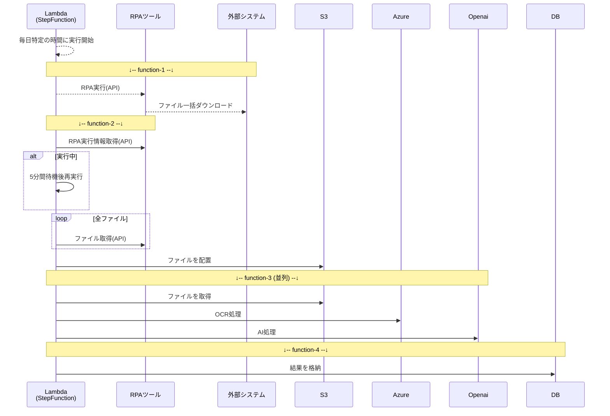

## 概要

最近、AIを活用した業務プロセスの自動化についての記事をよく見かけるようになりましたね！
AIにはまだまだ改善の余地が多くありますが、上手く扱えれば業務効率を大幅に向上させることが可能です。

今回は、RPAツールとAWSのStep Functionsを使用して、業務プロセスを自動化した事例を紹介します。

:::message
この記事で紹介する自動化プロセスは、作業の効率化と速度向上を目指したものであり、完全自動化ではありません。
未だAIは完全ではなく間違いを犯すため、最終的な品質保証のためには人の手によるレビューが不可欠となります。
:::

## AWS Step Functionsとは

AWS Step Functionsは、AWS LambdaやAWS BatchをはじめとしたAWSの各サービスを、ワークフローという形で連携・自動化できるサービスです。
条件に応じて処理を分岐させたり、一定時間処理を待ち合わせたりと自由度も高く、エラーハンドリングや状態管理も自動で行われるため、複雑なプロセスも安定運用することが可能です。

https://docs.aws.amazon.com/ja_jp/step-functions/latest/dg/welcome.html

## 自動化した業務プロセス

今回自動化した業務プロセスは以下のようなものです。

1. 毎日大量にアップロードされるファイルを一つずつ手動でダウンロード。
2. ダウンロードしたファイルを一つずつ開き、特定の条件に基づいて処理を実行。
3. 処理結果をデータベースに格納。

このプロセスの自動化により、作業者の工数削減を実現しました。

## 構築内容

では実際の構築内容を解説していきます。
今回構築したシステムの構成図は以下です。


AWSのStep Functionsを用いた詳細な処理フローは以下の通りです。
一つずつ解説していきます。



### Step-1: ファイルダウンロード(RPA)

まず、外部サービスにAPIが用意されていなかったため、RPAツールを使い前日にアップロードされたファイルを一括ダウンロードするようにしました。
このStepで、LambdaからRPAツールのAPIを通じて自動実行しています。

### Step-2: RPA実行結果のポーリング

ファイルダウンロードには時間がかかるため、Step FunctionsのWaitステート・Choiceステートを組み合わせて実行終了を監視します。これにより、Lambdaの15分のタイムアウト制限を回避し、必要に応じて指定時間待機後に再実行を行うことが可能です。詳細は後述します。

### Step-3: AIでの処理

今回はファイルの内容を読み取る必要があるのですが、OpenAI単体での日本語文字列の抽出はまだ完璧ではないので、Azure AI VisionのRead APIを使用してOCR処理を実行しています。
その後、OCRした文字列をOpenAIのAPIに渡し、特定の処理を実行します。

https://learn.microsoft.com/ja-jp/azure/ai-services/computer-vision/overview
https://platform.openai.com/docs/overview

このプロセスをStep FunctionsのMapステートを用いて並列に実行することで、全体の処理速度を向上させました。
また、一部の処理がエラーになった場合でも、成功した処理の結果を次のステップに進めることができるため、耐障害性と効率性が向上しました。

### Step-4: 処理結果の格納

最後に処理結果をまとめてDBに格納します。
ここには記載していませんが、Slackへの完了通知等も実施しています。

## Step Functionsの設定方法

今回はServerless FrameworkのTypeScriptプラグインを使用して構築しました。
Serverlessを使用することにより、Lambda関数の作成やStep Functionsの設定、ネットワーク周りの設定などを一括で行うことが可能です。

https://www.serverless.com/

実際に構築したServerlessの設定値は以下です。
(今回はLambda関数の詳細は省略します。)

```ts: serverless.ts
import type { AWS } from '@serverless/typescript'

const serverlessConfiguration: AWS = {
  functions: {
    FuncStep1: {...},
    FuncStep2: {...},
    FuncStep3: {...},
    FuncStep4: {...}
  },
  ...
}

const stepFunctionsConfiguration = {
  stepFunctions: {
    stateMachines: {
      AutoProcess: {
        name: 'auto-process',
        events: [
          {
            schedule: {
              rate:    'cron(0 21 * * ? *)',
              enabled: true
            }
          }
        ],
        definition: {
          Comment: '業務プロセスの自動化',
          StartAt: 'TaskStep1',
          States: {
            TaskStep1: {
              Type:       'Task',
              Resource:   { 'Fn::GetAtt': ['FuncStep1', 'Arn'] },
              ResultPath: '$.step1Results',
              Next:       'WaitBeforeStep2'
            },
            WaitBeforeStep2: {
              Type:    'Wait',
              Seconds: 300,
              Next:    'TaskStep2'
            },
            TaskStep2: {
              Type:       'Task',
              Resource:   { 'Fn::GetAtt': ['FuncStep2', 'Arn'] },
              InputPath:  '$.step1Results',
              ResultPath: '$.step2Results',
              Next:       'CheckStep2Status'
            },
            CheckStep2Status: {
              Type:    'Choice',
              Choices: [
                {
                  Variable:     '$.step2Results.status',
                  StringEquals: 'SUCCESS',
                  Next:         'TaskStep3'
                }
              ],
              Default: 'WaitBeforeStep2'
            },
            TaskStep3: {
              Type:           'Map',
              ItemsPath:      '$.step2Results.items',
              ResultPath:     '$.step3Results',
              MaxConcurrency: 3,
              ItemProcessor:  {
                StartAt: 'TaskStep3Partial',
                States:  {
                  TaskStep3Partial: {
                    Type:     'Task',
                    Resource: { 'Fn::GetAtt': ['FuncStep3', 'Arn'] },
                    Catch: [
                      {
                        ErrorEquals: ["States.ALL"],
                        Next:        "CatchError"
                      }
                    ],
                    End: true
                  },
                  "CatchError": {
                    Type: "Succeed"
                  }
                }
              },
              Next: 'TaskStep4'
            },
            TaskStep4: {
              Type:       'Task',
              Resource:   { 'Fn::GetAtt': ['FuncStep4', 'Arn'] },
              InputPath:  '$.step3Results',
              End:        true
            }
          }
        }
      }
    }
  }
}

module.exports = {
  ...serverlessConfiguration,
  ...stepFunctionsConfiguration
}
```

今回の設定でのポイントは、スケジュール設定、ポーリングのための「Wait」と「Choice」ステートの利用、および「Map」ステートでの並列化とエラーハンドリングです。
以下でそれぞれ解説します。

### スケジュール設定

Step Functionsは、EventBridgeと連携し、特定のスケジュールに基づいて自動的にワークフローを開始することが可能です。
今回は以下の部分で毎日6時(JST)に実行するように設定しています。

```ts
events: [
  {
    schedule: {
      rate:    'cron(0 21 * * ? *)',
      enabled: true
    }
  }
],
```

### Waitステート & Choiceステートでのポーリング

- **Waitステート**: 長時間実行が必要なタスクの間に特定の時間だけ処理を一時停止し、その後でタスクを再開します。これは、外部システムからの応答を待つ際などに有効です。

- **Choiceステート**: 条件分岐を提供し、タスクの実行結果に基づいて次に実行するステップを選択します。今回の例で言うと、RPAがファイルのダウンロードを完了したかどうかをチェックし、未完了ならWaitステートに戻るように設定しています。

https://docs.aws.amazon.com/ja_jp/step-functions/latest/dg/amazon-states-language-wait-state.html
https://docs.aws.amazon.com/ja_jp/step-functions/latest/dg/amazon-states-language-choice-state.html

今回は以下のStep1, Step2の部分で使用しています。

```ts
TaskStep1: {
  ...
  Next: 'WaitBeforeStep2'
},
WaitBeforeStep2: {
  Type:    'Wait',
  Seconds: 300,
  Next:    'TaskStep2'
},
TaskStep2: {
  ...
  Next: 'CheckStep2Status'
},
CheckStep2Status: {
  Type:    'Choice',
  Choices: [
    {
      Variable:     '$.step2Results.status',
      StringEquals: 'SUCCESS',
      Next:         'TaskStep3'
    }
  ],
  Default: 'WaitBeforeStep2'
},
```

### Mapステートでの並列化とエラーハンドリング

- **Mapステート**: 複数の入力項目に対して並列処理を実行することができます。これは、多数のファイルを並列に処理する場合などに役立ちます。各入力項目に対して独立したタスクを実行し、それらの結果を集約します。

- **エラーハンドリング**: タスクが失敗した場合に備えて、エラーをキャッチして適切に処理するロジックを設定できます。例えば、エラーが発生した場合にリトライするか、特定のエラーに対しては異なる処理を行うなどの設定が可能です。

https://docs.aws.amazon.com/ja_jp/step-functions/latest/dg/amazon-states-language-map-state.html
https://docs.aws.amazon.com/ja_jp/step-functions/latest/dg/concepts-error-handling.html

今回はstep3の部分で並列処理を実行し、特定のタスクが失敗してもタスク自体は成功とみなし、処理が完了したタスクだけ次のstep4に進めるように設定しています。

```ts
TaskStep3: {
  Type: 'Map',
  ...
  ItemProcessor:  {
    StartAt: 'TaskStep3Partial',
    States:  {
      TaskStep3Partial: {
        ...
        Catch: [
          {
            ErrorEquals: ["States.ALL"],
            Next:        "CatchError"
          }
        ]
      },
      "CatchError": {
        Type: "Succeed"
      }
    }
  },
  Next: 'TaskStep4'
}
```

### デプロイ

あとは実際に関数のロジックを実装し、slsコマンドでデプロイすれば環境構築は完了です。
非常に便利ですね！

```sh
sls deploy --verbose
```

## まとめ

今回は、AI、RPAツール、そしてAWSのStep Functionsを組み合わせて煩雑な業務プロセスを効率化した事例をご紹介しました。
AIはまだ完全ではないため、最終的な品質保証のためには人のレビューが必須ですが、上手く使いこなせれば業務をより効率化できそうですね。

今後もAIを活用した事例を紹介していく予定です。
最後までお読みいただき、ありがとうございました。
