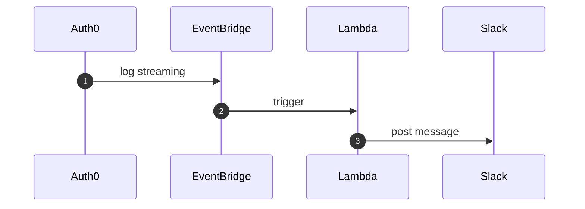

## 概要

業務で認証プラットフォームとして Auth0 を使用しています。
そこでエラーログを Slack 通知する必要があったのですが、実装方法を説明している記事等が中々見つからず苦労したため、実際に構築したフローを紹介したいと思います。

## 前提

この記事では、以下の技術を使用して構築を行います。
詳しい解説は省略しますので、概要は公式ドキュメントを参照してください。

- [Auth0](https://auth0.com)
- [EventBridge](https://aws.amazon.com/jp/eventbridge/)
- [Serverless (Lambda)](https://www.serverless.com/)
- [Terrraform](https://www.terraform.io/)
- [SlackAPI](https://api.slack.com/lang/ja-jp)

## フロー

実際に構築するフローと、各レイヤーの役割は以下のような感じです。



- Auth0 Log Streaming
  - ログの1次フィルター
  - ストリーム通知
- EventBridge
  - ログの2次フィルター
  - Lambda 関数をトリガー
- Lambda
  - ログの整形
  - Slack 通知

:::message
Auth0 公式の Slack Integration もあったのですが、通知用の API の自作や、カスタム Webhook が必要だったため、今回は使用せず独自のフローで実装しています。

[slack-log-streaming](https://marketplace.auth0.com/integrations/slack-log-streaming)
:::

## 実装

では実際に構築手順を解説していきます。
今回は Auth0 と AWS のリソースに関しては、コンソールから作成する方法と Terraform で作成する方法の両方を解説します。

サンプルコードは以下 GitHub リポジトリに用意しています。
https://github.com/taroshun32/auth0-alert-to-slack-sample

## Auth0 Log Streaming

まずは Auth0 の Log Streaming の設定からはじめていきます。
https://auth0.com/docs/customize/log-streams

ドキュメントにある通り、この機能では Auth0 のイベントログをリアルタイムに連携先の外部サービスに配信することができます。

Auth0 コンソールの `Monitoring > Streams` から `Create Log Stream` のボタンを押下し、`Amazon EventBridge` を選択して任意の名前で Event Stream を作成します。


`Settings` から今回使用する AWS アカウントの `ID` `Region` を入力し、`Filter by Event Category` のセレクトボックスから通知したいイベントを選択します。(ログの1次フィルター設定)

各イベントの詳細は以下公式ドキュメントを参照してください。
https://auth0.com/docs/customize/log-streams/event-filters

今回は例として Failure 系のイベントを全て設定していきます。


設定が終わったら `Save` ボタンを押せば Auth0 での設定は完了です。

:::details Terraform で構築する場合はこちら
```tf:log-stream.tf
resource "auth0_log_stream" "event_bridge" {
  name   = "Amazon EventBridge"
  type   = "eventbridge"
  status = "active"

  filters = [
    {
      "name" = "auth.login.fail"
      "type" = "category"
    },
    {
      "name" = "auth.logout.fail"
      "type" = "category"
    },
    {
      "name" = "auth.signup.fail"
      "type" = "category"
    },
    {
      "name" = "auth.silent_auth.fail"
      "type" = "category"
    },
    {
      "name" = "auth.token_exchange.fail"
      "type" = "category"
    },
    {
      "name" = "management.fail"
      "type" = "category"
    },
    {
      "name" = "user.fail"
      "type" = "category"
    }
  ]

  sink {
    aws_account_id = var.aws_account_id
    aws_region     = "ap-northeast-1"
  }
}
```

```tf: variables.tf
variable "aws_account_id" {
  type = string
}
```
:::

## Serverless (Lambda)

次に Slack への通知処理を行う Lambda 関数を作成していきます。
Serverless を使用して構築するため、まだ持ってない方は `serverless` module をインストールして下さい。

```sh
npm install -g serverless
```

今回は `aws-node-typescript (v3)` のテンプレートを使用します。

```sh
> serverless create --template-url https://github.com/serverless/examples/tree/v3/aws-node-typescript --path auth0-alert-to-slack

✔ Project successfully created in "auth0-alert-to-slack" (2s)

> tree .
.
├── README.md
├── handler.ts
├── package.json
└── serverless.yml

5 directories, 13 files
```

SlackAPI を使用するため、`@slack/web-api` をインストールします。

```sh
npm install @slack/web-api
```

また SlackApp を作成し、以下の設定を行なって下さい。

- `OAuth & Permissions` から `Bot Token Scopes (chat:write)` を設定
- `Install to Workspace` ボタンから、アプリをワークスペースにインストール
- 作成したアプリを通知するチャンネルに追加

[＠koki](https://zenn.dev/kou_pg_0131) さんの以下の記事がとても分かりやすく参考になります。
[Slack API を使用してメッセージを投稿する](https://zenn.dev/kou_pg_0131/articles/slack-api-post-message)

これで準備は整ったので、実際に関数の中身を実装していきます。
Auth0 のログメッセージは、`event.detail` に Json 形式で入っています。
今回はサンプルなので中身をそのまま Slack へと通知してみます。

```ts: handler.ts
import { WebClient } from '@slack/web-api'

export async function notify(event) {
  
  const SLACK_BOT_TOKEN  = process.env.SLACK_BOT_TOKEN
  const SLACK_CHANNEL_ID = process.env.SLACK_CHANNEL_ID

  const client = new WebClient(SLACK_BOT_TOKEN)

  await client.chat.postMessage({
    channel: SLACK_CHANNEL_ID,
    blocks:  [
      {
        type: "section",
        text: {
          type: "mrkdwn",
          text: "```" + JSON.stringify(event.detail, null, 2) + "```"
        }
      }
    ]
  })
}
```

```yml: serverless.yml
service: auth0-alert-to-slack
frameworkVersion: '3'

provider:
  name:    aws
  runtime: nodejs18.x
  region:  ap-northeast-1

functions:
  notify:
    handler: handler.notify

plugins:
  - serverless-esbuild

```

これで実装は完了したので、`serverless` コマンドでデプロイします。

```sh
serverless deploy --verbose
```

デプロイ後、以下の環境変数を設定しておいて下さい。

- SLACK_BOT_TOKEN
- SLACK_CHANNEL_ID

これで Serverless の構築は完了です。

## EventBridge

最後に AWS の EventBridge の設定を行います。
EventBridge は Auth0 などのイベントソースからリアルタイムデータのストリームを配信し、そのデータを Lambda などのターゲットにルーティングすることができます。

まず AWS コンソールの `EventBridge > Partner event source` を確認すると、先ほど設定した auth0 のイベントが表示されているかと思います。


イベントを選択し、 `Associate with event bus` ボタンを押下するとカスタムイベントバスが作成され、Auth0 のイベントが送信されるようになります。


次にイベントルールを作成します。
`EventBridge > Buses > Rules` から `Create rule` ボタンで作成画面へと進み、以下を設定後 `Next` ボタンを押下します。

- Name: 任意の名前
- Event bus: 先ほど作成したカスタムイベントバス
- Rule type: event pattern

するとルールの詳細画面に遷移すると思いますが、基本はデフォルトのまま Event Pattern の枠までスクロールし、

- Event source: EventBridge partners
- Partner: Auth0

を設定後、`Edit Pattern` のボタンを押下します。


ここでログの2次フィルター設定を行います。

先ほどの Auth0 側の Log Streaming 設定では event category 単位でしか filter 設定ができなかったのですが、実際にはより細かい event type 単位での filter が必要となってきます。

`Login Failure` を例にあげると

- `fp`:	Incorrect password
- `fu`:	Invalid email or username

などのように、システム側ではどうしようもないユーザの操作ミスなどのエラーを通知するとキリがないため、これらの event type を通知しないよう filter していきます。

```json
{
  "account": ["000000000000"],
  "detail": {
    "data": {
      "type": [{
        "anything-but": ["fp", "fu"]
      }]
    }
  }
}
```

:::details ※ Auth0 から配信されるログの Preview
```json
{
  "id": "623053cf-8e0f-9203-f464-e789cf18b0e2",
  "detail-type": "Auth0 log",
  "source": "aws.partner/auth0.com/example-tenant-635d694a-8a5a-4f1a-b223-1e0424edd19a/auth0.logs",
  "account": "123456789012",
  "time": "2020-01-29T17:26:50Z",
  "region": "us-west-2",
  "resources": [],
  "detail": {
    "log_id": "",
    "data": {
      "date": "2020-01-29T17:26:50.193Z",
      "type": "sapi",
      "description": "Create a log stream",
      "client_id": "",
      "client_name": "",
      "ip": "",
      "user_id": "",
      "log_id": ""
    }
  }
}
```
:::

`anything-but` 構文を使用して filter 設定しています。
EventBridge の Pattern 設定の詳細に関しては以下公式ドキュメントを参照してください。
https://docs.aws.amazon.com/eventbridge/latest/userguide/eb-event-patterns.html

最後に Event Target として先ほど作成した Lambda 関数を設定すれば Eventbridge の構築も完了です。


:::details Terraform で構築する場合はこちら
```tf: event-bridge.tf
resource "aws_cloudwatch_event_bus" "auth0_error_log" {
  name              = var.auth0-event-name
  event_source_name = var.auth0-event-name
}

resource "aws_cloudwatch_event_rule" "auth0_error_log" {
  name           = "auth0-error-log"
  event_bus_name = aws_cloudwatch_event_bus.auth0_error_log.name

  event_pattern = <<EOF
{
  "account": ["${var.aws_account_id}"],
  "detail": {
    "data": {
      "type": [ { "anything-but": [
        "fp",
        "fu"
      ] } ]
    }
  }
}
EOF
}

data "aws_lambda_function" "auth0_alert_to_slack" {
  function_name = "auth0-alert-to-slack-dev-notify"
}

resource "aws_lambda_permission" "allow_auth0_alert_to_slack" {
  action        = "lambda:InvokeFunction"
  function_name = data.aws_lambda_function.auth0_alert_to_slack.arn
  principal     = "events.amazonaws.com"
  source_arn    = aws_cloudwatch_event_rule.auth0_error_log.arn
}

resource "aws_cloudwatch_event_target" "auth0_error_log" {
  rule           = aws_cloudwatch_event_rule.auth0_error_log.name
  event_bus_name = aws_cloudwatch_event_bus.auth0_error_log.name
  target_id      = "auth0-error-log"
  arn            = data.aws_lambda_function.auth0_alert_to_slack.arn
}
```

```tf: variables.tf
variable "aws_account_id" {
  type = string
}

variable "auth0-event-name" {
  type = string
}
```
:::

## まとめ

ここまでの手順を全て問題なく完了していれば、Auth0 で何かしらのエラーを発生させると Slack にエラーログが飛んでくるかと思います。

もっとより良い構築方法などありましたらコメントで教えていただけると幸いです。

## 参考

- [Slack API を使用してメッセージを送信する](https://zenn.dev/kou_pg_0131/articles/slack-api-post-message)
