## はじめに

最近AWS App Runner上で動作するNode.jsアプリケーションからBigQueryに接続する機会があったのですが、EC2やLambdaとは異なり、コンテナ環境（App Runner / ECS / Fargate）ではWorkload Identity Federationの設定に一工夫必要だったので、自分用メモとして残しておきます。

## 概要

Workload Identity Federationは、AWSやAzureなどの外部IDプロバイダーの認証情報を使って、GCPリソースにアクセスするための仕組みです。サービスアカウントキー（JSONファイル）を使わずに、よりセキュアな認証が可能になります。

## 認証フロー

全体の流れは以下です。順に解説します。

```mermaid
sequenceDiagram
    participant App as アプリケーション
    participant SDK as AWS SDK<br/>(fromNodeProviderChain)
    participant Container as コンテナ認証情報<br/>(169.254.170.2)
    participant STS as GCP STS<br/>(sts.googleapis.com)
    participant IAM as GCP IAM Credentials<br/>(iamcredentials.googleapis.com)
    participant BQ as BigQuery API

    App->>SDK: 1. 認証情報を要求
    SDK->>Container: 2. GET /v2/credentials/{uuid}
    Container-->>SDK: AccessKeyId, SecretAccessKey, Token
    SDK-->>App: AWS認証情報

    Note over App: 3. AWS STS GetCallerIdentity<br/>署名付きリクエストを作成

    App->>STS: 4. POST /v1/token<br/>(署名付きAWSリクエスト)
    Note over STS: AWS署名を検証<br/>Workload Identity Pool確認
    STS-->>App: GCPアクセストークン

    App->>IAM: 5. POST /generateAccessToken
    Note over IAM: サービスアカウント<br/>偽装権限を確認
    IAM-->>App: サービスアカウントトークン

    App->>BQ: 6. BigQuery APIリクエスト
    BQ-->>App: クエリ結果
```



## 前提条件

### AWS側

- App Runner / ECS / Fargate でアプリケーションが動作していること
- タスク/サービスにIAMロールが割り当てられていること

### GCP側

- Workload Identity Poolが作成されていること
- AWS Providerが追加されていること
- サービスアカウントにIAMバインディングが設定されていること

設定方法は後述の「GCP設定」セクション、または[公式ドキュメント](https://cloud.google.com/iam/docs/workload-identity-federation-with-other-clouds)を参照してください。

## EC2とコンテナ環境の違い

GCPコンソールでWorkload Identity Federation設定を生成すると、EC2のInstance Metadata Service（IMDS）を前提とした設定が出力されます。コンテナ環境ではこの設定をそのまま使用できないため、カスタム実装が必要です。

| 環境                        | メタデータエンドポイント | 認証情報取得方法                                                             |
| --------------------------- | ------------------------ | ---------------------------------------------------------------------------- |
| EC2                         | `169.254.169.254`        | Instance Metadata Service (IMDS)                                             |
| App Runner / ECS / Fargate  | `169.254.170.2`          | コンテナ認証情報エンドポイント + `AWS_CONTAINER_CREDENTIALS_RELATIVE_URI`    |

## 実装

### 必要なパッケージ

```bash
npm install google-auth-library @google-cloud/bigquery @aws-sdk/credential-providers
```

:::message
今回はBigQueryへの接続を例として実装します。
:::

### カスタムAWS認証情報サプライヤー

`google-auth-library`の`AwsSecurityCredentialsSupplier`インターフェースを実装し、AWS SDK v3の`fromNodeProviderChain`を使用します。

```typescript
// src/auth/aws-credentials-supplier.ts

import type {
  AwsSecurityCredentialsSupplier,
  ExternalAccountSupplierContext,
  AwsSecurityCredentials,
} from "google-auth-library";
import { fromNodeProviderChain } from "@aws-sdk/credential-providers";

export class ContainerAwsCredentialsSupplier implements AwsSecurityCredentialsSupplier {
  private readonly region: string;

  constructor() {
    const region = process.env.AWS_REGION || process.env.AWS_DEFAULT_REGION;
    if (!region) {
      throw new Error(
        "AWS region not found. Set AWS_REGION or AWS_DEFAULT_REGION environment variable."
      );
    }
    this.region = region;
  }

  async getAwsRegion(_context: ExternalAccountSupplierContext): Promise<string> {
    return this.region;
  }

  async getAwsSecurityCredentials(
    _context: ExternalAccountSupplierContext
  ): Promise<AwsSecurityCredentials> {
    const credentialsProvider = fromNodeProviderChain();
    const credentials = await credentialsProvider();

    return {
      accessKeyId: credentials.accessKeyId,
      secretAccessKey: credentials.secretAccessKey,
      token: credentials.sessionToken,
    };
  }
}
```

`fromNodeProviderChain`は実行環境を自動検出し、適切な認証情報プロバイダーを選択します。EC2/ECS/Fargate/App Runner/Lambdaで共通のコードで動作します。

### BigQueryクライアント

カスタムサプライヤーを`AwsClient`に渡し、`BigQuery`クライアントの`authClient`として使用します。

> Cloud Storage、Pub/Sub等の他のGoogle Cloudサービスでも同様に使用できます。

```typescript
// src/db/bigquery-client.ts

import { BigQuery } from "@google-cloud/bigquery";
import { AwsClient } from "google-auth-library";
import { ContainerAwsCredentialsSupplier } from "../auth/aws-credentials-supplier.js";

const WORKLOAD_IDENTITY_CONFIG = {
  audience: "//iam.googleapis.com/projects/YOUR_PROJECT_NUMBER/locations/global/workloadIdentityPools/YOUR_POOL/providers/YOUR_PROVIDER",
  subject_token_type: "urn:ietf:params:aws:token-type:aws4_request",
  service_account_impersonation_url: "https://iamcredentials.googleapis.com/v1/projects/-/serviceAccounts/YOUR_SA@YOUR_PROJECT.iam.gserviceaccount.com:generateAccessToken",
  token_url: "https://sts.googleapis.com/v1/token",
};

function createBigQueryClient(): BigQuery {
  const awsCredentialsSupplier = new ContainerAwsCredentialsSupplier();

  const authClient = new AwsClient({
    audience: WORKLOAD_IDENTITY_CONFIG.audience,
    subject_token_type: WORKLOAD_IDENTITY_CONFIG.subject_token_type,
    service_account_impersonation_url: WORKLOAD_IDENTITY_CONFIG.service_account_impersonation_url,
    token_url: WORKLOAD_IDENTITY_CONFIG.token_url,
    aws_security_credentials_supplier: awsCredentialsSupplier,
  });

  return new BigQuery({
    projectId: "your-gcp-project",
    location: "US",
    authClient,
  });
}
```

## GCP設定

### 1. Workload Identity Poolの作成

```bash
gcloud iam workload-identity-pools create "your-pool" \
  --project="YOUR_PROJECT_ID" \
  --location="global" \
  --display-name="Your Pool"
```

### 2. AWS Providerの追加

```bash
gcloud iam workload-identity-pools providers create-aws "your-provider" \
  --project="YOUR_PROJECT_ID" \
  --location="global" \
  --workload-identity-pool="your-pool" \
  --account-id="YOUR_AWS_ACCOUNT_ID"
```

### 3. サービスアカウントへのIAMバインディング

```bash
gcloud iam service-accounts add-iam-policy-binding \
  YOUR_SA@YOUR_PROJECT.iam.gserviceaccount.com \
  --project=YOUR_PROJECT_ID \
  --role="roles/iam.workloadIdentityUser" \
  --member="principalSet://iam.googleapis.com/projects/YOUR_PROJECT_NUMBER/locations/global/workloadIdentityPools/your-pool/attribute.aws_role/arn:aws:sts::YOUR_AWS_ACCOUNT:assumed-role/YOUR_ROLE_NAME"
```

### 4. サービスアカウントへのBigQuery権限付与

```bash
gcloud projects add-iam-policy-binding YOUR_PROJECT_ID \
  --member="serviceAccount:YOUR_SA@YOUR_PROJECT.iam.gserviceaccount.com" \
  --role="roles/bigquery.dataViewer"
```

必要に応じて`roles/bigquery.jobUser`（クエリ実行権限）も付与してください。

## 環境変数

コンテナ環境で自動設定される環境変数：

| 変数名                                   | 説明                     |
| ---------------------------------------- | ------------------------ |
| `AWS_REGION`                             | AWSリージョン            |
| `AWS_CONTAINER_CREDENTIALS_RELATIVE_URI` | コンテナ認証情報のパス   |

これらは App Runner / ECS / Fargate が自動で設定するため、明示的な設定は不要です。

## まとめ

AWSコンテナ環境からGoogle CloudリソースにWorkload Identity Federationで接続する際のポイントをまとめます。

- GCPが生成する設定ファイルはEC2（IMDS）を前提としており、コンテナ環境ではそのまま使えない。
- `google-auth-library`の`AwsSecurityCredentialsSupplier`インターフェースを実装することで対応可能。
- `@aws-sdk/credential-providers`の`fromNodeProviderChain`を使うと、環境を自動検出してくれるため実装がシンプルになる。

同じ構成でハマっている方の参考になれば幸いです。

## 参考リンク

- [google-auth-library - npm](https://www.npmjs.com/package/google-auth-library)
- [@aws-sdk/credential-providers - npm](https://www.npmjs.com/package/@aws-sdk/credential-providers)
- [AWS Container credential provider - AWS Documentation](https://docs.aws.amazon.com/sdkref/latest/guide/feature-container-credentials.html)
- [Workload Identity Federation - Google Cloud](https://cloud.google.com/iam/docs/workload-identity-federation)
