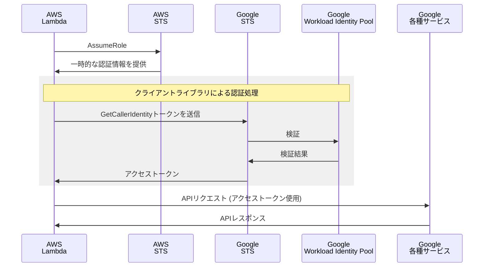

## 概要

Workload Identity連携を使用することで、サービスアカウントキーを発行せずにAWSなどの外部ワークロードから各種Googleサービスの操作が可能です。
https://cloud.google.com/iam/docs/workload-identity-federation?hl=ja

業務で少し触れる機会があったので、今回は自分への備忘録も兼ねて、認証フローとAWS Lambdaから各種Googleサービスを操作するまでの構築手順を書いてみたいと思います。

## Workload Identity連携

Workload Identity連携は、AWSやAzure等の外部IDプロバイダ（IdP）と連携し、Google Cloudのリソースへのアクセスを可能にします。
処理の流れは以下です。
1. GCP外のアプリケーション（Workload）は、自環境のIDプロバイダ（IdP）に対して認証しクレデンシャルを取得します。
2. IdPから得たクレデンシャルをGoogleのセキュリティトークンサービス（STS）に渡し、アクセストークンを取得します。
3. 2のアクセストークンを用いてサービスアカウントの権限を借用し、Google Cloudのリソースにアクセスします。


上記の処理の流れを実現するために、以下の設定が必要となります。(構築手順は後述します)
1. Workload Identity PoolにIdentity Providerを登録しておきます。
2. Workload Identity PoolのIdentityがサービスアカウントの権限を借用できるよう、必要な権限を設定しておきます。


> 引用：[YouTube「What is Workload Identity Federation?」](https://youtu.be/4vajaXzHN08)

今回構築するAWSのケースでは、LambdaがAWS STSから取得した一時的な認証情報を使用して、Google Cloudのセキュリティトークンサービス（STS）エンドポイントを呼び出します。STSエンドポイントはこのトークンを検証し、有効期限の短いGoogleのアクセストークンと交換します。このアクセストークンを使用して、LambdaはGoogle Cloudおよび関連するGoogleサービスのリソースにアクセスできます。

フロー図は以下です。



今回はクライアントライブラリを使用するため認証フローはかなり簡略化していますが、詳細なフローに関しては以下のドキュメントを参照して下さい。
https://cloud.google.com/iam/docs/workload-identity-federation-with-other-clouds?hl=ja#rest

## サービスアカウントに関して

以下のドキュメントに記載のある通り、Google Cloudリソースの操作に関してはサービスアカウントを使用せずに、外部IDに直接アクセスを許可できます。
https://cloud.google.com/iam/docs/workload-identity-federation?hl=ja#direct-resource-access

BigQueryやCloud StorageといったGoogle Cloudリソース操作に限ればこちらの方法が推奨されているようですが、今回は以下のような他のGoogleサービスも操作できるよう、サービスアカウントの権限借用を使用して構築しました。

- Google Drive
- Google Analytics
- Google Search Console

:::message
リソースへの直接アクセスは一部のGoogle Cloudサービスでは制限があります。
https://cloud.google.com/iam/docs/federated-identity-supported-services?hl=ja#list
:::

## 構築手順

では実際に構築手順を解説します。
今回はAWS・Google Cloudの各リソースはTerraformを使用して作成します。

おおまかな手順は以下です。

- [AWS] IAMロールの作成
- [Google] 必要となるAPIの有効化
- [Google] サービスアカウントの作成
- [Google] Workload Identityの作成
   1. Workload Identityプールの設定
   2. Workload Identityプロバイダの設定
   3. サービスアカウントをプロバイダと接続
- [Lambda] Workload Identityの構成情報（Jsonファイル）を使用して認証処理

順番に詳しく解説していきます。

### [AWS] IAMロールの作成

Lambda関数にアタッチするIAMロールを作成します。(今回は省略しますが、必要となる権限は都度付与して下さい)
AWSの一時的な認証情報を生成するため、AssumeRoleを使用しています。

```tf
resource "aws_iam_role" "lambda_role" {
  name = "lambda-role"

  assume_role_policy = jsonencode({
    Version   = "2012-10-17"
    Statement = [
      {
        Action = "sts:AssumeRole"
        Effect = "Allow"
        Sid    = ""
        Principal = {
          Service = "lambda.amazonaws.com"
        }
      }
    ]
  })
}
```

### [Google] 必要となるAPIの有効化

Workload Identity連携で必要となるAPIを有効化します。

```tf
locals {
  services = toset([
    "iam.googleapis.com",
    "cloudresourcemanager.googleapis.com",
    "iamcredentials.googleapis.com",
    "sts.googleapis.com"
  ])
}

resource "google_project_service" "enable_api" {
  for_each = local.services
  project  = var.project_id
  service  = each.value
}
```

コンソールからでもボタン一つで対応可能です。
https://cloud.google.com/iam/docs/workload-identity-federation-with-other-clouds?hl=ja#configure

### [Google] サービスアカウントの作成

サービスアカウントを作成し、必要となる権限を付与します。
今回は例として、Biqueryの操作のための最小権限をカスタムロールとして付与しています。

```tf
resource "google_service_account" "lambda_sa" {
  project      = var.project_id
  account_id   = "lambda-sa"
  display_name = "lambda-sa"
}

resource "google_project_iam_custom_role" "bigquery_job_create" {
  project      = var.project_id
  role_id     = "bigquery_job_create"
  title       = "bigquery_job_create"
  permissions = ["bigquery.jobs.create"]
}

resource "google_project_iam_member" "lambda_sa_bigquery_job_create" {
  project = var.project_id
  role    = google_project_iam_custom_role.bigquery_job_create.id
  member  = "serviceAccount:${google_service_account.lambda_sa.email}"
}
```

### [Google] Workload Identityの作成

Workload Identityプール、Workload Identityプロバイダを作成します。
AWSを選択した場合、プロバイダの属性マッピングはデフォルト値が存在するので特に設定は不要です。カスタムマッピングを指定する場合は [GetCallerIdentity](https://docs.aws.amazon.com/STS/latest/APIReference/API_GetCallerIdentity.html) のレスポンスフィールドを使用できます。

属性マッピングに関しての詳細は、以下のドキュメントを参照して下さい。
https://cloud.google.com/iam/docs/workload-identity-federation-with-other-clouds?hl=ja#mappings-and-conditions

```tf
resource "google_iam_workload_identity_pool" "id_pool" {
  project                   = var.project_id
  workload_identity_pool_id = "id-pool"
  display_name              = "id-pool"
}

resource "google_iam_workload_identity_pool_provider" "aws_provider" {
  project                            = var.project_id
  workload_identity_pool_id          = google_iam_workload_identity_pool.id_pool.workload_identity_pool_id
  workload_identity_pool_provider_id = "aws-connect"
  display_name                       = "aws-connect"

  aws {
    account_id = var.aws_id
  }
}
```

Workload IdentityプールID、Workload Identityプロバイダ属性情報から以下の形式で外部IDが構成されます。
`principal://iam.googleapis.com/projects/<PROJECT_NUMBER>/locations/global/workloadIdentityPools/<Workload Identity プールID>/<属性値(マッピングによって異なる部分)>`

この外部IDに対してWorkload Identityユーザーロール（roles/iam.workloadIdentityUser）を付与することにより、サービスアカウントの権限借用を許可します。
今回は属性値として、先ほど作成したLambda用のIAMロールのARNを設定しています。

```tf
resource "google_service_account_iam_binding" "workload_identity_binding_aws_lambda" {
  service_account_id = google_service_account.lambda_sa.name
  role               = "roles/iam.workloadIdentityUser"
  members            = [
    "principalSet://iam.googleapis.com/${google_iam_workload_identity_pool.id_pool.name}/attribute.aws_role/arn:aws:sts::${var.aws_id}:assumed-role/lambda_role",
  ]
}
```

最後にコンソールから構成情報（Jsonファイル）をダウンロードしておきましょう。Lambdaで使用します。


内容は以下のようになっています。
```json
{
  "type": "external_account",
  "audience": "//iam.googleapis.com/projects/<プロジェクト番号>/locations/global/workloadIdentityPools/aws-id-pool-1/providers/aws-provider",
  "subject_token_type": "urn:ietf:params:aws:token-type:aws4_request",
  "service_account_impersonation_url": "https://iamcredentials.googleapis.com/v1/projects/-/serviceAccounts/lambda-sa@<プロジェクトID>.iam.gserviceaccount.com:generateAccessToken",
  "token_url": "https://sts.googleapis.com/v1/token",
  "credential_source": {
    "environment_id": "aws1",
    "region_url": "http://169.254.169.254/latest/meta-data/placement/availability-zone",
    "url": "http://169.254.169.254/latest/meta-data/iam/security-credentials",
    "regional_cred_verification_url": "https://sts.{region}.amazonaws.com?Action=GetCallerIdentity&Version=2011-06-15"
  }
}
```
このファイルには秘密鍵は含まれておらず、Workload Identityプールで指定したプロバイダおよびアカウントからのみこの情報を使用してリソースにアクセスが可能です。（プロジェクトIDは伏せています）

これでGoogle Cloudでの設定は完了です。

### [Lambda] Workload Identityの構成情報（Jsonファイル）を使用して認証処理

準備が整ったので、実際にLambdaからWorkload Identity連携を使用して、Googleサービスを操作してみます。
まず、先ほどダウンロードしたJsonファイルをLambda内に配置し、ファイルのパスを環境変数 `GOOGLE_APPLICATION_CREDENTIALS` に設定します。

クライアントライブラリを使用して認証処理を行います。今回は `Node.js` の `google-api-nodejs-client` を使用しています。
テストとして、BigQueryに接続するコードは以下です。

```ts
import { google } from 'googleapis'

const auth = new google.auth.GoogleAuth({
  projectId: '****'
  scopes:    ['https://www.googleapis.com/auth/bigquery']
})

const bigquery = google.bigquery({ version: 'v2', auth })
await bigquery.jobs.query({
  projectId:   '****',
  requestBody: {
    query: 'SELECT 1 AS test'
  }
})
```

構成情報は直接設定することも可能です。
```ts
  const workloadIdentityConfig = {
    "type": "external_account",
    ...
  }

  const auth = new google.auth.GoogleAuth({
  projectId:   '****'
  credentials: workloadIdentityConfig,
  scopes:      ['https://www.googleapis.com/auth/bigquery']
})
```

また、今回はサービスアカウントを使用しているため、Google DriveやAnalyticsなど他のGoogleサービスの操作も可能です。（サービス側で適切な権限設定は必要です）

```ts
import { google, drive_v3 } from 'googleapis'

const auth = new google.auth.GoogleAuth({
  projectId: '****'
  scopes:    ['https://www.googleapis.com/auth/drive']
})

const drive = google.drive({ version: 'v3', auth })
...
```

## まとめ

今回Workload Identity連携を使用したことで、サービスアカウントキーの発行やローテンションが必要なくなり、セキュリティリスクや運用コストを軽減できました。
AWS以外にも対応しているので、積極的に使用していきたいなと思います。
