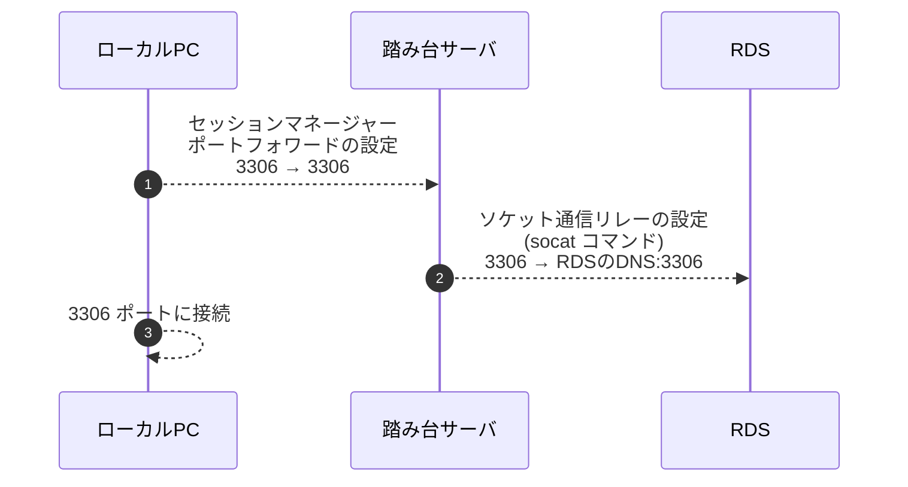

## 背景

今まで Session Manager を用いてローカルPCから RDS に接続する際は、以下の流れで接続していました。(SSH アカウントを個別に発行したくなかったため)
1. ローカルPCと踏み台サーバ間をセッションマネージャーポートフォワード
2. 踏み台サーバから RDS 間をソケット通信リレー
3. MySQL コマンドで接続



この場合接続前に一旦踏み台サーバに接続して socat コマンドを実行する必要があり、少し面倒だったのですが、Session Manager のリモートホストへのポートフォワード機能を使えばより簡単に接続できたので手順を書いてみたいと思います。

## 前提

Session Manager に関しては以下を参照してください。
https://docs.aws.amazon.com/systems-manager/latest/userguide/session-manager.html

## 事前準備

`AWS CLI` と `Session Manager Plugin` をインストールします。
手順は以下の公式ドキュメントを参照してください。
https://docs.aws.amazon.com/ja_jp/cli/latest/userguide/getting-started-install.html
https://docs.aws.amazon.com/ja_jp/systems-manager/latest/userguide/session-manager-working-with-install-plugin.html

踏み台サーバや RDS は既に構築してあるものとし、ここでの手順は省きます。

:::message
踏み台サーバは SSM Agent の導入と SSM 用の IAM ロールの付与が必要です。
SSM Agent のバージョンは「3.1.1374.0」以上である必要があります。
IAM ロールには「AmazonSSMManagedInstanceCore」の権限が付与してあれば大丈夫です。
:::

## 手順

手順としてはすごく簡単で、「AWS-StartPortForwardingSessionToRemoteHost」と言う名前の SSM ドキュメントを用いてコマンドを1つ叩くだけです。
bastion_instance_id と rds_endpoint に関しては適宜環境に合わせて書き換えてください。
```
aws ssm start-session \
  --target {bastion_instance_id} \
  --document-name AWS-StartPortForwardingSessionToRemoteHost \
  --parameters '{"host":["{rds_endpoint}"],"portNumber":["3306"], "localPortNumber":["3306"]}'

Starting session with SessionId: xxxxxxxxxxxxxxxxx
Port 3306 opened for sessionId xxxxxxxxxxxxxxxxx.
Waiting for connections...
```

公式のドキュメントは以下を参照してください。
https://docs.aws.amazon.com/systems-manager/latest/userguide/session-manager-working-with-sessions-start.html#sessions-remote-port-forwarding

あとはこの状態で別タブなりを開いて、localhost の 3306 ポート宛に接続すれば RDS にログインできます。

```
mysql -h 127.0.0.1 -P 3306 -u **** -p "DB"
```

もっと早くこの機能のリリースに気づいていればと思いました。。
今後はこの機能を用いて、GitHubActions などから自動で DB の Dump を取得する処理などを書いてみたいなと思います。
