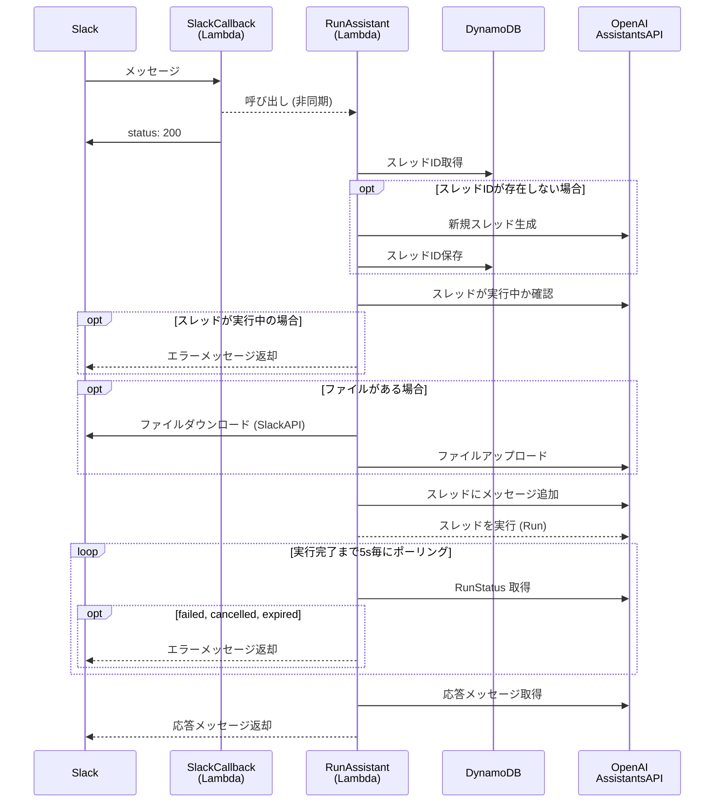

# 概要

OpenAI AssistantsAPI は独自のアプリケーションに AI アシスタントを構築できる機能です。

https://platform.openai.com/docs/assistants/overview

今回は AssistantsAPI を使用して Slack 上で AI とチャットができる環境を構築したので、その構築手順を書いてみたいと思います。
GPTs も便利ですが、Slack 上でチャットできるようにすることで、ChatGPT のプラン関係なくワークスペースに参加している人は誰でも使用することが可能となります。(GPTs と違って従量課金になるのでその点は注意が必要です。)

実装コードは下記リポジトリにあります。
https://github.com/taroshun32/slack-chatbot-with-openai-assistant

:::message
OpenAI の Assistants API は現在まだベータ版です。
また、今回の記事では Function Calling に関しては未対応となります。
:::

# 前提

この記事では、以下の技術を使用して構築を行います。
詳しい解説は省略しますので、概要は公式ドキュメントを参照してください。

- [Serverless (Lambda)](https://www.serverless.com/)
- [Terrraform (AWS)](https://www.terraform.io/)
- [SlackAPI](https://api.slack.com/lang/ja-jp)

# フロー

今回構築するシステムのフローです。
Assistant の生成は予めダッシュボードから済ませておく前提で構築してます。
Lambda 関数は OpenAI の Node.js SDK を使用して TypeScript で記述してます。



# 実装コード (Serverless)

では実際の実装コードを解説していきます。
コードはすべて Serverless で管理しており、以下のテンプレートを使用しています。

```sh
❯ serverless create --template aws-nodejs-typescript
```

すべてのコードを解説することは不可能なので、重要な部分を抽出して解説します。

## SlackCallback (Lambda関数)

SlackApp へのメンションをトリガーに呼び出される関数です。
この関数の役割は、後続の RunAssistant (Lambda関数) を呼び出すだけです。
SlackApp のコールバックのタイムアウトに引っかからないようにこのような構成となってます。

[slack-callback > handler.ts](https://github.com/taroshun32/slack-chatbot-with-openai-assistant/blob/main/serverless/src/functions/slack-callback/handler.ts)
::::details 全コードはこちら
https://github.com/taroshun32/slack-chatbot-with-openai-assistant/blob/main/serverless/src/functions/slack-callback/handler.ts
::::

Slack からの URL 検証用イベントである、`url_verification` にも対応しています。
これは後述する SlackApp の設定の際に必要です。

```ts
case 'url_verification':
  return {
    statusCode: 200,
    body:       request.challenge,
    headers:    {
      'Content-Type': 'application/json'
    }
  }
```

SlackApp へのメンションをトリガーに呼び出される `event_callback` イベントの際は、認証トークンの検証の後、RunAssistant 関数を非同期で Invoke しています。
その際レスポンスの生成には時間がかかるため、予めトリガー元のスレッドに「お待ちください」スタンプをつけるようにしています。

```ts
case 'event_callback': {
  if (request.token !== context.SLACK_VERIFICATION_TOKEN)
    return { statusCode: 400, body: 'トークンが無効です。' }

  const slackClient = new WebClient(context.SLACK_BOT_TOKEN)

  await slackClient.reactions.add({
    channel:   request.event.channel,
    name:      'wait',
    timestamp: request.event.ts
  })

  const event: RunAssistantEvent = {
    channel:         request.event.channel,
    text:            request.event.text.replaceAll(/<@U[0-9A-Z]+>/g, ''),
    fileIds:         request.event.files?.map((file) => file.id) ?? [],
    ts:              request.event.ts,
    threadTs:        request.event.thread_ts,
    threadBroadcast: request.event.subtype === 'thread_broadcast'
  }
  await lambdaClient.send(
    new InvokeCommand({
      InvocationType: 'Event',
      FunctionName:   'run-assistant',
      Payload:        JSON.stringify(event)
    })
  )

  return {
    statusCode: 200,
    body:       '',
    headers:    {
      'Content-Type': 'text/plain'
    }
  }
}
```

:::message
認証キーなどの秘匿情報は AWS のパラメータストアに格納するようにしており、middy というライブラリを使用して Context に格納しています。
middy に関しては別記事で解説しているので、詳細は以下をご参照ください。
https://zenn.dev/taroshun32/articles/serverless-middy-ssm
:::

## RunAssistant (Lambda関数)

実際に AssistantsAPI を使用してチャットを構築する関数です。

[run-assistant > handler.ts](https://github.com/taroshun32/slack-chatbot-with-openai-assistant/blob/main/serverless/src/functions/run-assistant/handler.ts)
::::details 全コードはこちら
https://github.com/taroshun32/slack-chatbot-with-openai-assistant/blob/main/serverless/src/functions/run-assistant/handler.ts
::::

メインのハンドラと、いくつかの関数で構成されているので順に解説します。

### handler

呼び出し元の SlackCallback 関数から受け取ったパラメータを元に Assistants API を実行する run 関数を呼び出し、応答メッセージを Slack に返却します。
メッセージはスレッドへの返信として返却し、同一スレッド内であれば過去のやり取りを記憶するようにしてます。(ここの詳細は後述します。)

```ts
const handler: Handler = async (
  event:   RunAssistantEvent,
  context: SSMContext
) => {
  ...
  const replies = await run(event, slackClient, openai, context.OPENAI_ASSISTANT_ID)
  await postMessage(slackClient, event, replies)
  ...
}

async function postMessage(slackClient: WebClient, event: RunAssistantEvent, texts: string[]) {
  await slackClient.chat.postMessage({
    channel:         event.channel,
    thread_ts:       event.threadTs ?? event.ts,
    text:            texts.join('\n'),
    reply_broadcast: event.threadBroadcast || undefined,
    blocks:          texts.map((text) => ({ type: 'section', text: { type: 'mrkdwn', text } }))
  })
}
```

### run()

AssistantsAPI を実行し、応答メッセージを取得する関数です。
まず createOrGetThread 関数 (後述) を呼び出して openai の thread を取得し、スレッドの実行状態の確認を行います。
スレッドが実行中の場合は処理を中断し、Slack にエラーメッセージを返却しています。

```ts
const assistant = await openai.beta.assistants.retrieve(assistantId)
const thread    = await createOrGetThread(event, openai)

const runs    = await openai.beta.threads.runs.list(thread.id)
const running = runs.data.find(run => run.status === 'in_progress')
if (running) throw new AlreadyRunning(running)
```

次に Slack のメッセージにファイルが添付されている場合は event に fileIds が含まれているので、すべてのファイルを以下の手順で OpenAI 側にアップロードします。
1. [downloadFileFromSlack](https://github.com/taroshun32/slack-chatbot-with-openai-assistant/blob/main/serverless/src/libs/download-file-from-slack.ts) を使用して SlackAPI 経由でファイルを /tmp にダウンロード
2. [uploadFileToOpenAI](https://github.com/taroshun32/slack-chatbot-with-openai-assistant/blob/main/serverless/src/libs/upload-file-to-openai.ts) を使用して OpenAI API 経由でファイルを OpenAI 側にアップロード

```ts
const fileIds = await Promise.all(
  event.fileIds.map(async fileId => {
    const filePath = await downloadFileFromSlack(slackClient, fileId)
    return uploadFileToOpenAI(openai, filePath)
  })
)
```

```ts:download-file-from-slack.ts
export const downloadFileFromSlack = async (slackClient: WebClient, fileId: string): Promise<string> => {
  const file  = await slackClient.files.info({ file: fileId })
  const url   = file.file.url_private
  const token = slackClient.token

  const response = await axios.get(url, {
    headers:      { Authorization: `Bearer ${token}` },
    responseType: 'arraybuffer',
  })

  const filePath = path.join('/tmp', fileId)
  fs.writeFileSync(filePath, response.data)

  return filePath
}
```

```ts:upload-file-to-openai.ts
export const uploadFileToOpenAI = async (openai: OpenAI, filePath: string) => {
  const file = await openai.files.create({
    file:    fs.createReadStream(filePath),
    purpose: "assistants",
  })

  return file.id
}
```

次にスレッドにメッセージを追加します。
先ほどのファイルが存在する場合は、ここで同時に FileIds を連携します。

```ts
await openai.beta.threads.messages.create(thread.id, {
  role:     'user',
  content:  event.text,
  file_ids: fileIds
})
```

最後に assistant を指定して thread を実行します。
実行は非同期で行われ、checkRunStatus 関数 (後述) を使用して実行ステータスが「completed」になるまで、5秒毎にポーリングを実施しています。

```ts
const run = await openai.beta.threads.runs.create(thread.id, {
  assistant_id: assistant.id
})
await checkRunStatus(openai, thread.id, run.id)

const messages = await openai.beta.threads.messages.list(thread.id)

const result = []
for (const message of messages.data) {
  if (message.role === 'user') break
  for (const c of message.content) {
    switch (c.type) {
      case 'text':
        result.push(c.text.value)
        break
      case 'image_file':
        result.push('画像の生成は未対応です。')
    }
  }
}
return result.reverse()
```

### createOrGetThread()

既存のスレッドを取得するか、存在しない場合は新しいスレッドを作成します。
この関数で Slack 側のスレッドと OpenAI 側のスレッドの紐付けを実施しています。

まず DynamoDB から Slack の threadTs に対応するレコードを取得し、レコードが存在する場合は対応する OpenAI のスレッドを返却します。

```ts
const threadTs = event.threadTs ?? event.ts

const record = await documentClient.send(
  new GetCommand({
    TableName: process.env.OPENAI_THREAD_TABLE,
    Key:       { threadTs }
  })
)

if (record.Item) return openai.beta.threads.retrieve(record.Item.threadId)
```

レコードが存在しない場合は新しい OpenAI のスレッドを作成し、そのスレッド情報を DynamoDB に保存します。(レコードの有効期限は3日に設定しています。)

```ts
const thread = await openai.beta.threads.create()

await documentClient.send(
  new PutCommand({
    TableName: process.env.OPENAI_THREAD_TABLE,
    Item: {
      threadTs:   threadTs,
      threadId:   thread.id,
      expiration: (Math.floor(Date.now() / 1000) + 3 * 24 * 60 * 60).toString()
    }
  })
)
return thread
```

### checkRunStatus()

スレッドの実行ステータスが「completed」になるまで、ポーリングを行う関数です。

ステータスが「completed」の場合、関数は終了し、「failed」「cancelled」「expired」の場合は、エラーがスローされます。
ステータスが上記以外 (実行中) の場合は5秒間待機し、待機後自身を再起的に呼び出します。

```ts
async function checkRunStatus(openai: OpenAI, threadId: string, runId: string) {
  const runStatus = await openai.beta.threads.runs.retrieve(threadId, runId)
  if (runStatus.status === 'completed') {
    return
  } else if (
    runStatus.status === 'failed'    ||
    runStatus.status === 'cancelled' ||
    runStatus.status === 'expired'
  ) {
    throw new Error(runStatus.status)
  } else {
    await new Promise(resolve => setTimeout(resolve, 5000))
    return checkRunStatus(openai, threadId, runId)
  }
}
```

## デプロイ

ここまででコードの実装は完了なので、以下 Serverless のコマンドで AWS の環境にデプロイしておきましょう。
その際ログの `Stack Outputs` に吐かれる `HttpApiUrl` は後述する Slack のコールバック URL の設定で必要なので控えておいて下さい。

```sh
> serverless deploy --verbose
```

# AWS リソース

AWS の各リソースは terraform で構築します。
tfstate に関してはローカル管理前提で実装しているため、必要に応じて S3 など適切な箇所で管理するよう修正して下さい。

## DynamoDB

DynamoDB はスレッド情報の管理で使用します。
Slack の threadTs を主キーとし、expiration を TTL 属性とするテーブルを作成します。

https://github.com/taroshun32/slack-chatbot-with-openai-assistant/blob/main/terraform/aws/dynamo.tf

## IAM_Role

次に必要な認証情報を作成します。
今回作成するのは Serverless (Lambda関数) に付与するロールです。
以下 [serverless.ts](https://github.com/taroshun32/slack-chatbot-with-openai-assistant/blob/main/serverless/serverless.ts) で指定しています。
```ts
const serverlessConfiguration: AWS = {
  provider: {
    iam: { role: `arn:aws:iam::${process.env.AWS_ACCOUNT_ID}:role/serverless_role`},
    ...
  }
}
```

`serverless_role` には以下の権限を付与しています。

| 権限 | 説明 |
| --- | --- |
| `sts:AssumeRole` | Lambda がこのロールを引き受けることを許可します。 |
| `ssm:GetParameters`<br>`ssm:GetParametersByPath` | 特定のパラメータストアのパラメータを取得することを許可します。 |
| `kms:Decrypt` | KMSキーを使用してデータを復号化することを許可します。 |
| `logs:CreateLogStream`<br>`logs:CreateLogGroup`<br>`logs:TagResource`<br>`logs:PutLogEvents` | 特定のロググループでログストリームを作成し、ログイベントを管理することを許可します。 |
| `lambda:InvokeFunction` | 特定の Lambda 関数を呼び出すことを許可します。 |
| `dynamodb:GetItem`<br>`dynamodb:PutItem` | 特定の DynamoDB テーブルのレコードを取得し、レコードを追加または置き換えることを許可します。 |

https://github.com/taroshun32/slack-chatbot-with-openai-assistant/blob/main/terraform/aws/iam.tf

# OpenAI

次に OpenAI 周りの設定です。まず OpenAI ダッシュボードから Assistant を作成します。
今回は特に Retrieval は指定しませんが、特定のドキュメントを基にした RAG（Retrieval-Augmented Generation）のメカニズムを利用してメッセージを生成したい場合は、必要なファイルを指定し、Retrieval を ON に設定して下さい。


設定できたら以下を AWS のパラメータストアに設定して下さい。

- OpenAI API Key
- Assistant ID

# SlackApp

最後に SlackApp の設定を行います。
ここでは簡単な流れだけを説明しますので、詳細な手順については以下の公式ドキュメントをご覧ください。

https://api.slack.com/start/quickstart

## Event Subscriptions

Event Subscriptions の設定を行います。

まず、RequestURL にデプロイの際に控えておいた `HttpApiUrl` を設定します。
その際に `url_verification` イベントが走り、URLの検証が行われるはずです。

Snbscripe to bot events では `app_mention` を選択して下さい。
この設定を行うことで、SlackApp へのメンションをトリガーとして SlackCallback 関数が呼ばれるようになります。


## OAuth & Permissions

次に権限の設定を行います。
以下のパーミッションを追加して下さい。

| パーミッション | 説明 |
| --- | --- |
| `app_mentions:read` | アプリへのメンションを読み取ることを許可します。 |
| `chat:write` | メッセージを送信することを許可します。 |
| `files:read` | ファイルを読み取ることを許可します。 |
| `reactions:write` | リアクションを追加することを許可します。 |


最後に SlackApp をワークスペースにインストールし、任意のチャンネルに招待しておきます。
また、以下を AWS のパラメータストアに設定しましょう。
- Verification Token
- Bot User OAuth Token

これですべての設定が完了です。

# チャットを実行

実際にチャットで質問してみると、スレッド形式で応答メッセージが返ってくると思います。


実際の業務では、社内ドキュメントなどを基にした回答を生成するようにプロンプトを調整することで、様々な場面で有効活用できそうですね。
メッセージの stream 生成なども今後対応予定らしいので、対応されたら試してみたいと思います。

# 参考

- [SlackとOpenAI Assistants APIでGitHubのPRレビューを効率化する](https://developer.mamezou-tech.com/blogs/2023/12/06/slack-github-assistantsapi/)
